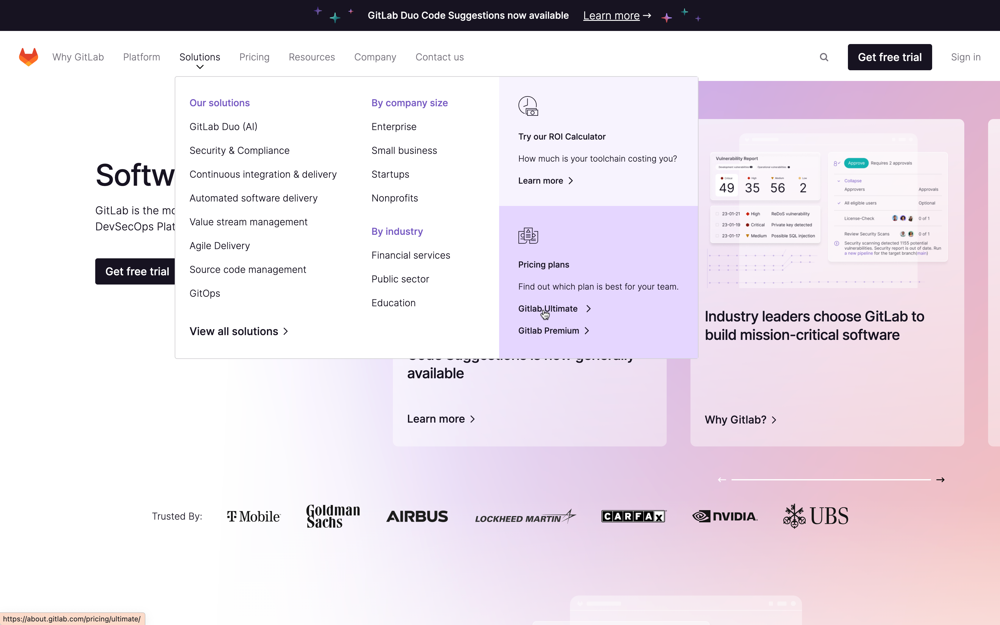
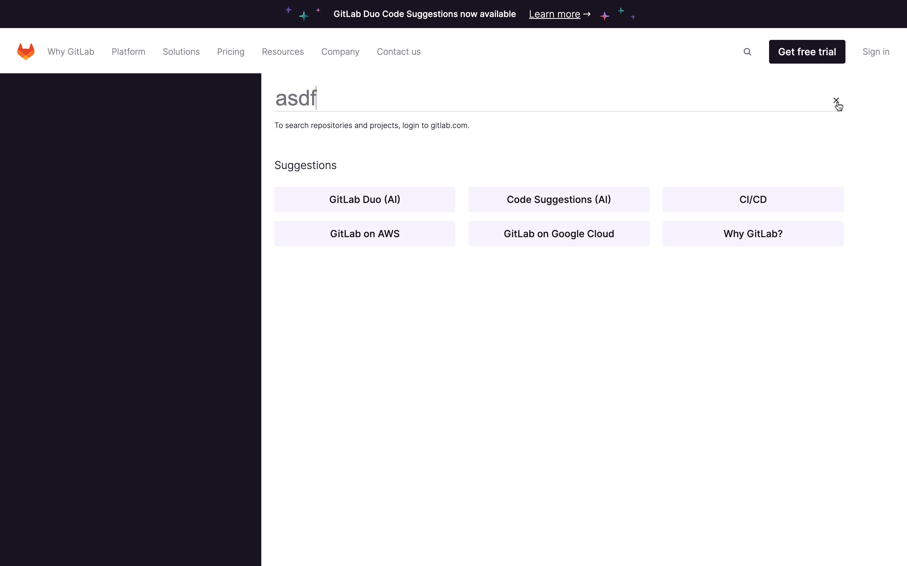
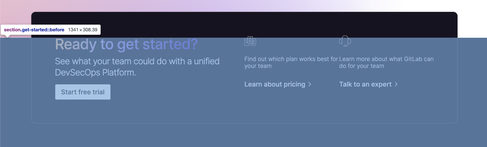
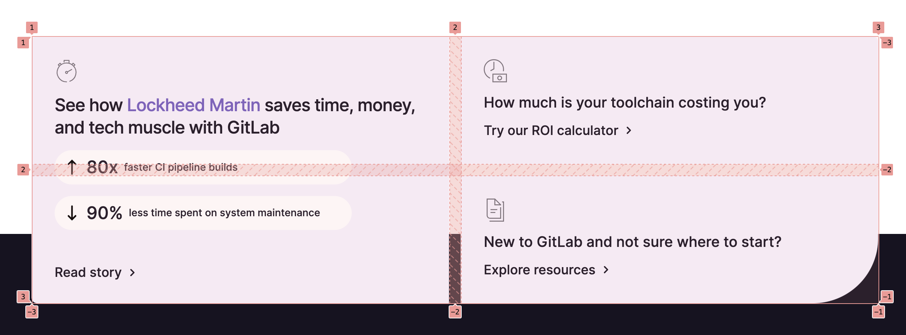
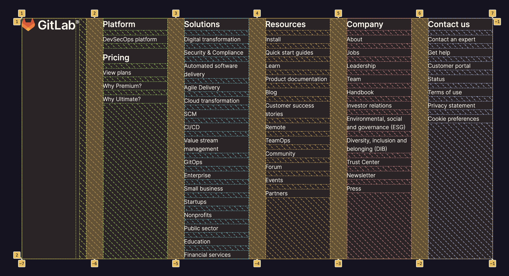
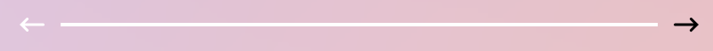
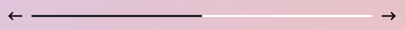

# Gitlab 클론 코딩
- 원본 사이트 : <a href="https://about.gitlab.com/" target="_blank">Gitlab</a>
- 클론 사이트 : <a href="https://gitlab-clone.pages.dev/" target="_blank">Gitlab Clone</a>

## 파일 구조
```
KDT8-M1
┣ index.html
┣ README.md
┣ images
┗ css
  ┣ common.css
  ┣ reset.css
  ┣ slider.css
  ┗ style.css
┗ js
  ┣ main.js
  ┗ slider.js
```

## 주요 구현 기능
1. ```position: sticky;```를 사용해 최상단 광고배너 및 그 아래 출력되는 헤더를 구현하였습니다.
2. CSS를 사용한 헤더 드롭다운 메뉴를 구현하였습니다.

3. ```position: fixed;``` 및 ```z-index```를 활용하여 화면 전체를 덮는 검색탭을 구현하였습니다.
  - ```input``` 요소와의 상호작용

4. ```:hover```를 이용한 버튼 호버 효과를 구현하였습니다.

5. ```transition```을 활용한 탭 스위칭 및 애니메이션 효과를 구현하였습니다.
  - ```scaleX```, ```translateY``` 애니메이션
  - 요소의 ```classList``` 조작 

6. 가상 요소를 활용해 섹션 일부분을 덮는 배경 요소를 구현하였습니다.

7. CSS Flexbox 및 Grid를 이용한 다양한 레이아웃을 구현하였습니다.


8. 자바스크립트를 이용한 슬라이더 기능을 구현하였습니다.
  - 마우스 휠을 이용해 좌우 이동
    - ```wheel``` 이벤트를 활용해 휠 사용 시에도 스크롤 변화값 탐지
  - 마우스 이벤트를 활용한 드래그 이동
    - ```mousemove``` 이벤트 시 변화값을 요소의 ```scrollLeft```에 적용
  - 버튼을 이용해 전체 슬라이더의 일정 비율 이동
    - 슬라이더 컨테이너 전체 너비의 절반 만큼 요소의 ```scrollLeft```에 적용
  - <a href="https://gsap.com/" target="_blank">GSAP</a>을 활용한 네비게이션 바 구현
    - 스크롤 변화값에 비례하여 네비게이션 요소에 ```scaleX``` 적용
  
  

## 아쉬웠던 점
1. 일부 요소에 시맨틱 태그를 적용하였으나 세부적인 부분으로 갈수록 사이트 구현에 급급해 태그 사용을 일관적으로 하지 못했습니다.
2. 모듈화를 도입하지 못해 html 및 css 파일의 크기가 매우 커졌습니다.
3. 반응형 브라우징 및 크로스 플랫폼 대응이 미흡하였습니다.
4. CSS에서 중복되는 코드가 많은데 코드 재사용 부분에서 아쉬웠습니다.

## 이후 리팩토링을 통해 개선한 점
1. 시맨틱 태그를 좀 더 적극적으로 사용해 요소의 의미를 나타내고자 했습니다.
2. CSS 파일을 여러개로 나눈 뒤 Parcel을 통해 번들링을 진행하였습니다.